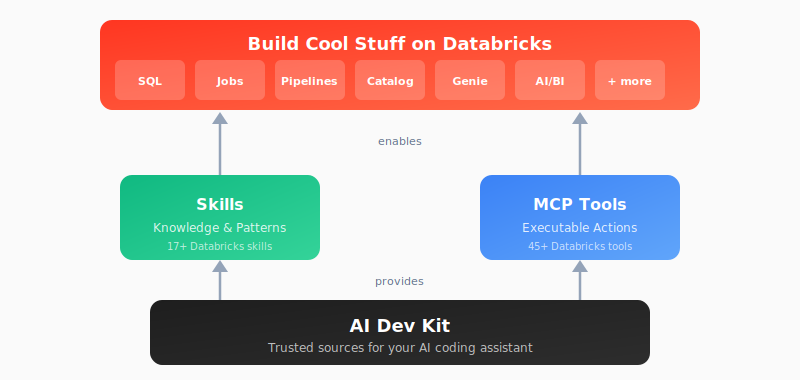

# Databricks AI Dev Kit

<p align="center">
  
</p>

---

## Overview

Vibecoding on Databricks just got a whole lot better. The **AI Dev Kit** gives your AI coding assistant (Claude Code, Cursor, Windsurf, etc.) the trusted sources it needs to build faster and smarter on Databricks.

<p align="center">
  
</p>

---

## What Can I Build?

- **Spark Declarative Pipelines** (streaming tables, CDC, SCD Type 2, Auto Loader)
- **Databricks Jobs** (scheduled workflows, multi-task DAGs)
- **AI/BI Dashboards** (visualizations, KPIs, analytics)
- **Unity Catalog** (tables, volumes, governance)
- **Genie Spaces** (natural language data exploration)
- **Knowledge Assistants** (RAG-based document Q&A)
- **MLflow Experiments** (evaluation, scoring, traces)
- **Model Serving** (deploy ML models and AI agents to endpoints)
- **Databricks Apps** (full-stack web applications)
- ...and more

---

## Choose Your Own Adventure

| Adventure | Best For | Start Here |
|-----------|----------|------------|
| :star: [**Starter Kit**](#starter-kit) | **Start here!** Claude Code + full Databricks integration | `ai-dev-project/` |
| [**Visual Builder**](#visual-builder-app) | Web-based UI for Databricks development | `databricks-builder-app/` |
| [**Skills Only**](#skills-only) | Teaching your AI Databricks patterns (no actions) | Install skills |
| [**MCP Tools Only**](#mcp-tools-only) | Just executable actions (no guidance) | Register MCP server |
| [**Core Library**](#core-library) | Building custom integrations (LangChain, OpenAI, etc.) | `pip install` |

---

## Quick Start

### Prerequisites

```bash
# Set your Databricks credentials
export DATABRICKS_HOST="https://your-workspace.cloud.databricks.com"
export DATABRICKS_TOKEN="your-token"

# Or use a profile from ~/.databrickscfg
export DATABRICKS_CONFIG_PROFILE="your-profile"
```

### Starter Kit

The fastest way to get started with Claude Code + Databricks:

```bash
git clone https://github.com/databricks-solutions/ai-dev-kit.git
cd ai-dev-kit/ai-dev-project
./setup.sh
claude
```

This installs skills + MCP tools and opens Claude Code ready to build on Databricks.

### Visual Builder App

Full-stack web application with chat UI for Databricks development:

```bash
cd ai-dev-kit/databricks-builder-app
./setup.sh
# Follow instructions to start the app
```

### Skills Only

Just want to teach your AI assistant Databricks patterns?

```bash
cd ai-dev-kit
./databricks-skills/install_skills.sh
```

Skills include: Spark Declarative Pipelines, Asset Bundles, MLflow Evaluation, Model Serving, Synthetic Data Generation, and [more](databricks-skills/).

### MCP Tools Only

Just want executable Databricks actions?

```bash
cd ai-dev-kit
./databricks-mcp-server/setup.sh

# Register with Claude Code
claude mcp add-json databricks "{
  \"command\": \"$(pwd)/.venv/bin/python\",
  \"args\": [\"$(pwd)/run_server.py\"]
}"
```

### Core Library

Use `databricks-tools-core` directly in your Python projects:

```python
from databricks_tools_core.sql import execute_sql

results = execute_sql("SELECT * FROM my_catalog.schema.table LIMIT 10")
```

Works with LangChain, OpenAI Agents SDK, or any Python framework. See [databricks-tools-core/](databricks-tools-core/) for details.

---

## What's Included

| Component | Description |
|-----------|-------------|
| [`databricks-tools-core/`](databricks-tools-core/) | Python library with high-level Databricks functions |
| [`databricks-mcp-server/`](databricks-mcp-server/) | MCP server exposing 50+ tools for AI assistants |
| [`databricks-skills/`](databricks-skills/) | 15 markdown skills teaching Databricks patterns |
| [`databricks-builder-app/`](databricks-builder-app/) | Full-stack web app with Claude Code integration |
| [`ai-dev-project/`](ai-dev-project/) | Starter template for new projects |

---

## Star History

<a href="https://star-history.com/#databricks-solutions/ai-dev-kit&Date">
 <picture>
   <source media="(prefers-color-scheme: dark)" srcset="https://api.star-history.com/svg?repos=databricks-solutions/ai-dev-kit&type=Date&theme=dark" />
   <source media="(prefers-color-scheme: light)" srcset="https://api.star-history.com/svg?repos=databricks-solutions/ai-dev-kit&type=Date" />
   
 </picture>
</a>

---

## License

(c) 2026 Databricks, Inc. All rights reserved.

The source in this project is provided subject to the [Databricks License](https://databricks.com/db-license-source). See [LICENSE.md](LICENSE.md) for details.

<details>
<summary><strong>Third-Party Licenses</strong></summary>

| Package | Version | License | Project URL |
|---------|---------|---------|-------------|
| [fastmcp](https://github.com/jlowin/fastmcp) | ≥0.1.0 | MIT | https://github.com/jlowin/fastmcp |
| [mcp](https://github.com/modelcontextprotocol/python-sdk) | ≥1.0.0 | MIT | https://github.com/modelcontextprotocol/python-sdk |
| [sqlglot](https://github.com/tobymao/sqlglot) | ≥20.0.0 | MIT | https://github.com/tobymao/sqlglot |
| [sqlfluff](https://github.com/sqlfluff/sqlfluff) | ≥3.0.0 | MIT | https://github.com/sqlfluff/sqlfluff |
| [litellm](https://github.com/BerriAI/litellm) | ≥1.0.0 | MIT | https://github.com/BerriAI/litellm |
| [pymupdf](https://github.com/pymupdf/PyMuPDF) | ≥1.24.0 | AGPL-3.0 | https://github.com/pymupdf/PyMuPDF |
| [claude-agent-sdk](https://github.com/anthropics/claude-code) | ≥0.1.19 | MIT | https://github.com/anthropics/claude-code |
| [fastapi](https://github.com/fastapi/fastapi) | ≥0.115.8 | MIT | https://github.com/fastapi/fastapi |
| [uvicorn](https://github.com/encode/uvicorn) | ≥0.34.0 | BSD-3-Clause | https://github.com/encode/uvicorn |
| [httpx](https://github.com/encode/httpx) | ≥0.28.0 | BSD-3-Clause | https://github.com/encode/httpx |
| [sqlalchemy](https://github.com/sqlalchemy/sqlalchemy) | ≥2.0.41 | MIT | https://github.com/sqlalchemy/sqlalchemy |
| [alembic](https://github.com/sqlalchemy/alembic) | ≥1.16.1 | MIT | https://github.com/sqlalchemy/alembic |
| [asyncpg](https://github.com/MagicStack/asyncpg) | ≥0.30.0 | Apache-2.0 | https://github.com/MagicStack/asyncpg |
| [greenlet](https://github.com/python-greenlet/greenlet) | ≥3.0.0 | MIT | https://github.com/python-greenlet/greenlet |
| [psycopg2-binary](https://github.com/psycopg/psycopg2) | ≥2.9.11 | LGPL-3.0 | https://github.com/psycopg/psycopg2 |

</details>

---

## Acknowledgments

MCP Databricks Command Execution API from [databricks-exec-code](https://github.com/databricks-solutions/databricks-exec-code-mcp) by Natyra Bajraktari and Henryk Borzymowski.
